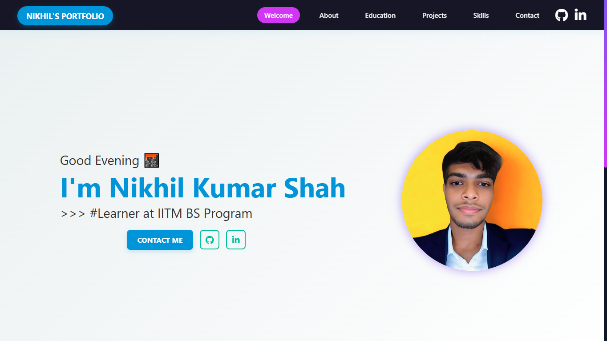
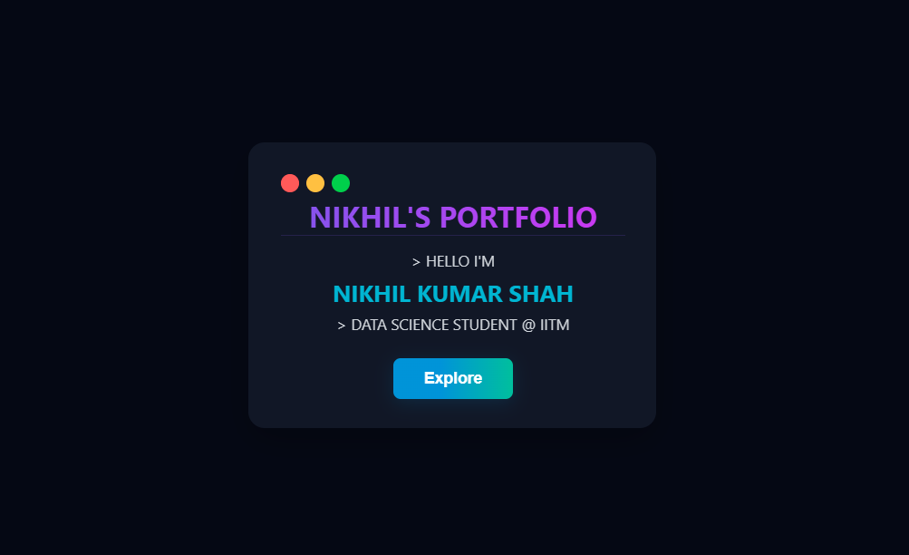

# Nikhil Kumar Shah — Portfolio Website 

> 🚀 A **modern, responsive, and professional** portfolio showcasing my **skills**, **projects**, **certifications**, and journey as a Data Science student at 🏫 **IIT Madras**.  
> Built with ❤️ clean, semantic code, creative UI, and a focus on **accessibility & performance**.

🌐 [**Live Demo**](https://nikhil-kumar-shah.github.io/portfolio/) | 📧 [Contact Me](mailto:nikhil102007@gmail.com)

---

## 🌟 Features

✅ **Fully Responsive** — Mobile-first & desktop-ready  
🎨 **Hero Section** — Dynamic greeting + typewriter effect  
🧾 **Sections:** About, Education, Skills, Projects, Certifications, Contact  
🖼️ **Projects Showcase** — Interactive cards with modal popups & screenshots  
📬 **Contact Form** — Integrated email form  
✨ **Smooth Animations** — Modern, clean, and elegant UI

---

## 🖥️ Tech Stack

### 🌐 Frontend
- 🧩 **HTML5** — semantic & accessible markup
- 🎨 **CSS3** — custom animations, hover effects & responsive grid
- 🧪 **JavaScript (Vanilla)** — DOM manipulation, modals, filters, typewriter animation
- 🔤 **Google Fonts & Font Awesome** — for typography & icons

### 📁 Hosting
- 🌐 **GitHub Pages**

---

## 📸 Screenshots

| 🏠 **Home Page** | 🗂️ **Log in page** |
|------------------|-----------------------|
|  |  |

---

## 🚀 Getting Started

You can view the live site here 👉  
🌐 [**Live Demo**](https://nikhil-kumar-shah.github.io/portfolio/)

Or clone & run locally:
```bash
git clone https://github.com/Nikhil-Kumar-Shah/portfolio.git
cd portfolio
open index.html
